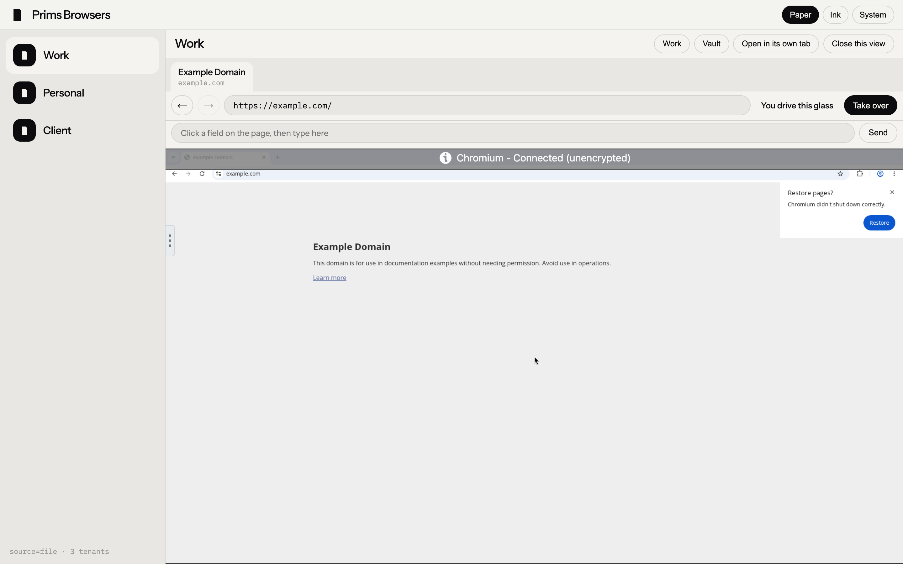
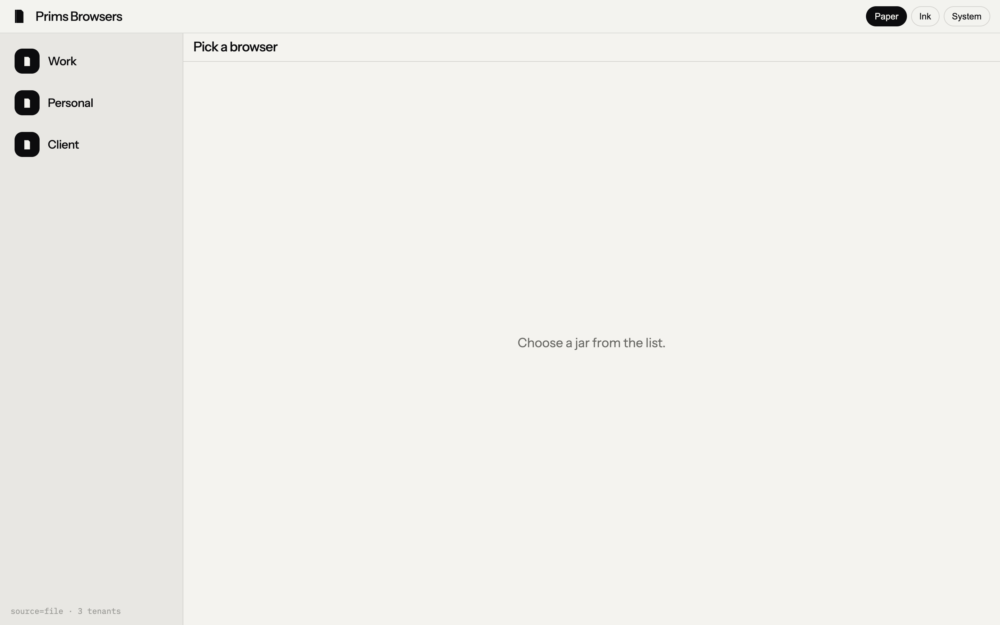
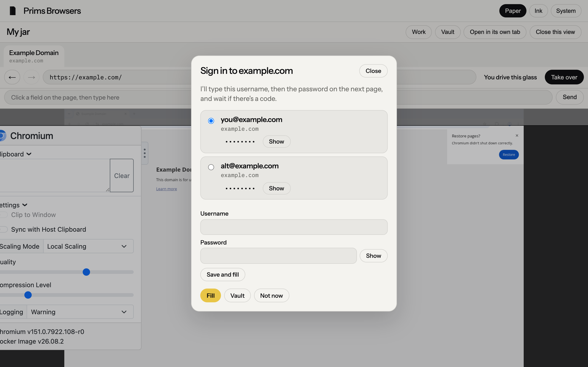
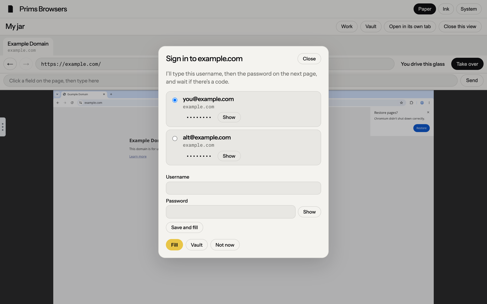

# Prims Browsers

[](LICENSE)
[](https://github.com/primfoundation/prims-browsers)

**Sandbox browsers agents can drive without touching your local mouse.** Each tenant is a headed Chromium jar (CDP + glass). Agents browse and take mouse control inside the jar; your Mac pointer stays yours.

| Deploy | Tenants |
|---|---|
| **Paseo plugin** | Usually **one** sandbox for that cell / workspace |
| **Local machine** | **Multi-tenant** — several jars side by side without sharing cookies or the host cursor |

A **system vault** ships with the toolkit; you can also connect your own vault(s). Not [eidos-browsing](https://github.com/eidos-agi).

<p align="center">
  
</p>

<p align="center">
  
  &nbsp;
  
</p>

<p align="center">
  
</p>

## Quick start

```bash
git clone https://github.com/primfoundation/prims-browsers.git
cd prims-browsers
cp tenants.example.json tenants.json
ln -sf "$(pwd)/bin/prims-browsers" ~/.local/bin/prims-browsers

docker compose -f jars/compose.yaml up -d --build   # optional sample jar(s)
# edit tenants.json glass.container / ports to match

prims-browsers doctor
prims-browsers open          # desk → http://127.0.0.1:7751/
```

```bash
prims-browsers tenants
prims-browsers tabs alpha
prims-browsers screenshot alpha --out /tmp/shot.png
prims-browsers record alpha start --out /tmp/jar.mp4
prims-browsers record alpha stop
```

`record` is ffmpeg x11grab of the jar's `:0`, not the Mac desktop.

## Register jars

`tenants.json` (gitignored; copy from `tenants.example.json`) or `PRIMS_BROWSERS_TENANTS`.

```json
{
  "source": "file",
  "tenants": [{
    "id": "alpha",
    "label": "Alpha",
    "home": "https://example.com/",
    "work": "https://example.com/",
    "glass": {
      "container": "prims-browsers-alpha",
      "vnc": "http://127.0.0.1:15801",
      "cdp": "http://127.0.0.1:19221"
    }
  }]
}
```

`work` is what **Work** / `POST /api/work` opens when no URL is passed (falls back to `home`). Add more `tenants` rows for local multi-tenant.

Sample compose: `jars/compose.yaml` (`alpha` / `beta` → example.com). Keep private fleets in gitignored `jars/compose.local.yaml`.

## Vault

**System vault** is always on (`~/.prim/prims-browsers/vault/`). You can also **connect your own vault(s)** (today: PaseoVault). Lists merge; new saves go to the write target (default: system).

```bash
cp vaults.example.json ~/.prim/prims-browsers/vaults.json   # optional
prims-browsers vaults
prims-browsers vaults connect paseo-vault ~/.paseo/paseo-vault --id paseo
prims-browsers vaults write system
```

Desk login ask / approve / fill uses the merged view. Tests isolate vaults under temp dirs.

```bash
prims-browsers test
python3 -m pytest tests/ -q
```

## Hands

**CDP first**, VNC/xdotool if the page will not yield. Glass is embedded in the desk (noVNC). Jar Chromium must not go fullscreen and hide chrome. Config lives under this repo / `~/.prim/` — not `~/.eidos-browsing/`.

Regenerate README shots: `python3 scripts/capture-screenshots.py`.

## Docs

- [CONTRIBUTING.md](CONTRIBUTING.md)
- [SECURITY.md](SECURITY.md)
- [CODE_OF_CONDUCT.md](CODE_OF_CONDUCT.md)
- [CHANGELOG.md](CHANGELOG.md)
- [AGENTS.md](AGENTS.md) — conventions for coding agents

## License

[MIT](LICENSE) © Prim Foundation
